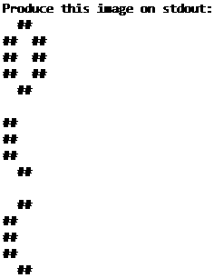

## Description
```
Golf With Gorbit 2023 DAY 2 (the pretty one)
```

This day was a bit special as the expected output was hidden behind a cryptic clue:
```
89504E470D0A1A0A0000000D49484452000000EC000001320103000000C35EAE
BC000000017352474200AECE1CE90000000467414D410000B18F0BFC61050000
0006                                                        504C
5445                                                        0000
00FFFFFFA5D99FDD000000097048597300000EC200000EC20115284A    8000
0001824944415468DEEDD6B16AC330100660D5F70055934543E00279    0197
2E1E                                                0A7A    9540
5F20                                                DD32    35AF
EA56    2FA0E24543E8F5E436A12EF8020AA6E0DE9141E4    B36C    21FD
4832    24559C965B4F84B919D281F8772EEC39E0572B0D    39F1    9F69
C083    D79E                                D9D6    0D38    E75B
53EF    7DDC                                BADA    F9B8    F669
EDEC    C6B8    1D332CE1AEC3F4BA7AA6E376    B978    C070    83EF
A903    7069    67DA7B0058064CA167840D06    600E    CCF9    E51D
37A0    CDBC    F7C7                AD5D    AC33    A766    C081
87B6    7A61    06FB                44DC    FBE3    0757    D55D
CF07    E68A    9F64    A6E60DAA    FCED    D0C5    DA3A    8B47
3096    876F    ADC5    B8C1F868    6DBD    E291    FF9E    C7D0
4FE1    E89C    5FE0    C86B        20F0    F0D9    3FE6    D4F8
E9B8    35B7    12C7    DA5F        C1AD    41B1    F7EE    301D
0B35    63CE    AB3D    BAE2D772CECA685E    A2C9    6118    0DC4
45CE    5919    CD0B    F7E6D51E5DF16B99    A4D2    B494    B1A6
6566    AC69    2961                        926A    D6AC    F796
1216    4A59    59F9                        FB2C    998C    859D
E574    D494    B3B0B39CCE92C998A4D2B494B1A66566    AC69    2961
924A    6FB9    A5ACB75C65E57FCBBAB794B0507A6F29    63BD    B7CC
8C35    2D25                                        4C52    695A
CA58    D332                                        3BD6    7B4B
090B    352553FC04A2A71DB59B65809D0000000049454E44AE4260    8200
```

However, this was just a .PNG file with symbols written out in hexadecimal format. Using `decoder.py` we can see the hidden image:



Expected Output:
```
  ##
##  ##
##  ##
##  ##
  ##

##
##
##
  ##

  ##
##
##
##
  ##
```

## Submissions
C 54 bytes: https://ideone.com/UAiZej
- gcc 8.3